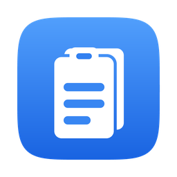

# Reclip

A clipboard history manager for macOS, modelled on the Windows <kbd>Win</kbd>+<kbd>V</kbd> panel.

Press a global hotkey and a floating panel appears over whatever app you're in. Pick a
past clip with the keyboard, the panel dismisses, and the clip is pasted straight back
into the app you came from.



## Features

- **Global hotkey** — <kbd>⌘</kbd><kbd>⇧</kbd><kbd>V</kbd> by default, with three alternative presets
- **Paste where you left off** — restores focus to the previous app, then pastes
- **Keyboard-first panel** — type to search, <kbd>↑</kbd><kbd>↓</kbd> to move, <kbd>↩</kbd> to paste, <kbd>esc</kbd> to close
- **Pin clips** you want to keep indefinitely
- **Automatic dedupe** — copying the same text again moves it to the top instead of duplicating
- **Menu bar agent** — no Dock icon, no window clutter
- **Launch at login**

## Requirements

- macOS **14.6** (Sonoma) or later
- **Apple Silicon** — the build is arm64-only

## Installing

Open `Reclip.dmg` and drag the app onto the Applications shortcut.

The app isn't notarized (that requires a paid Apple Developer Program membership), so
macOS will refuse to open it the first time. Go to **System Settings → Privacy &
Security** and click **Open Anyway**. Alternatively:

```bash
xattr -dr com.apple.quarantine /Applications/MacOsClipBoard.app
```

### Accessibility permission

Pasting for you requires **Accessibility** (System Settings → Privacy & Security →
Accessibility). Reclip asks on first use.

Without it the app still works — choosing a clip copies it to the clipboard and you
press <kbd>⌘</kbd><kbd>V</kbd> yourself. Only the automatic paste is lost.

> The permission is bound to the app's code signature. If you rebuild with a different
> signing identity, macOS treats it as a new app and you'll need to grant it again.

## History doesn't grow forever

Three independent limits, all adjustable in Settings:

| Limit | Default |
| --- | --- |
| Age — clips expire after last use | 1 week |
| Count — oldest clips pruned | 500 |
| Per-clip size | 256k characters |

**Pinned clips are exempt from all of them.** Settings also offers a manual sweep,
*Clear Unpinned*, and *Clear Everything* (which does remove pinned clips, behind a
confirmation).

## Privacy

Reclip records everything you copy. That is the point, and it is also the risk.

- **Everything stays on your Mac.** No telemetry, no network calls, no cloud sync.
- Clips marked `org.nspasteboard.ConcealedType` (the convention password managers use)
  are **never recorded**. Apps that don't set that marker aren't covered, so passwords
  typed into careless apps can still land in history.
- History lives in `~/Library/Application Support/MacOsClipBoard/`, which **is** included
  in Time Machine backups. Exclude that folder, or shorten the retention window, if you'd
  rather it didn't persist off-machine.

To wipe everything, quit the app and:

```bash
rm -rf ~/Library/Application\ Support/MacOsClipBoard
```

## Performance

It runs for your whole login session, so it's built to stay near-free. macOS has no
pasteboard-change notification, so polling is unavoidable — but `changeCount` is a cheap
IPC read, clip *contents* are only read when it actually changes, the timer carries a
large tolerance so macOS can coalesce wakeups instead of waking an idle CPU, and polling
stops entirely while the machine is asleep.

Measured: **~0.05 s of CPU across 80 s idle (≈0.06%), 63 MB resident.**

## Building

```bash
xcodebuild -project MacOsClipBoard.xcodeproj -scheme MacOsClipBoard -configuration Debug build
```

To produce a distributable disk image:

```bash
./make-dmg.sh
```

Because this is a background agent, a stale copy can keep running and hold the hotkey
after a rebuild. Kill it first — and check, because a wedged agent ignores plain `pkill`:

```bash
pkill -9 -x MacOsClipBoard && pgrep -x MacOsClipBoard
```

See [CLAUDE.md](CLAUDE.md) for architecture, the parts that are genuinely tricky
(pasteboard polling, the floating panel, focus restore, permissions), and debugging notes.

## Known limitations

- **Plain text only.** Rich text, images and file URLs are out of scope for v1.
- **Not notarized** — see [Installing](#installing).
- **Apple Silicon only.**
- The shortcut is chosen from four presets rather than a full key recorder.
